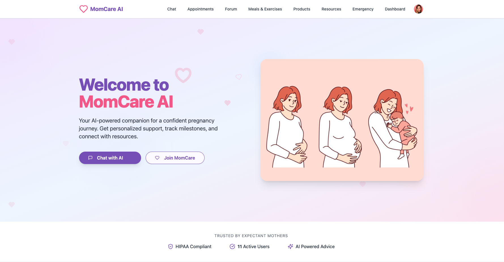
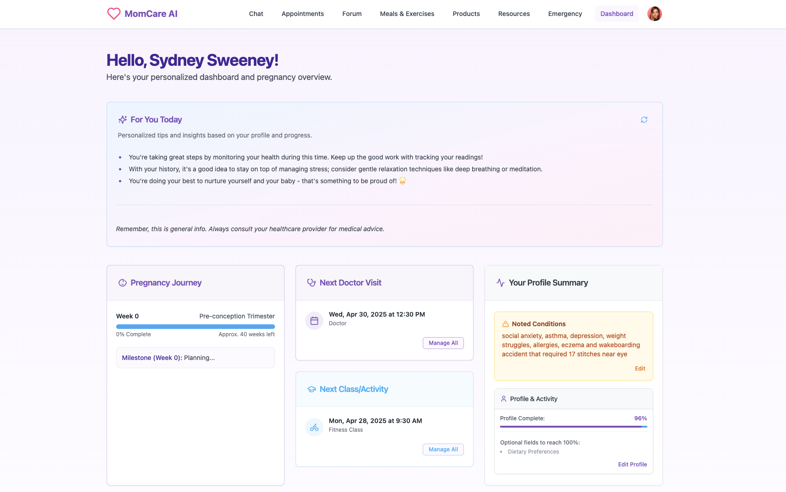
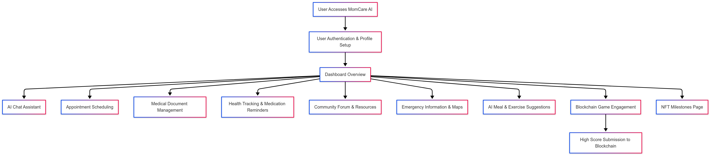

# 🚀 MomCare AI

> Your AI-powered companion throughout your pregnancy journey. Get personalized support, access resources, manage your health information securely, and connect with a real-time community.

---

## 📌 Problem Statement

**Problem Statement 1 – Weave AI magic with Groq**

**Problem Statement 2 – Unleash blockchain gameplay with Monad**

**Problem Statement 3 – Real-Time Data Experiences with Fluvio**

---

## 🎯 Objective

MomCare AI aims to provide comprehensive, personalized, and accessible support for expectant mothers. It addresses the critical needs for reliable information, convenient health management tools, and community connection during pregnancy by **uniquely integrating cutting-edge AI, real-time data streaming, and blockchain technologies.**

Pregnancy can be an exciting yet overwhelming journey, often leaving expectant mothers navigating a sea of information, anxieties about symptoms, challenges in managing appointments, and difficulties tracking crucial health metrics. Existing resources might be generic, fragmented across different apps, or lack immediate, personalized support. MomCare AI tackles this by:

*   **Reducing Information Overload & Anxiety:** Instant, personalized answers to pregnancy questions via a **Groq-powered multimodal AI Chat Assistant** (including document OCR).
*   **Simplifying Health Management:** An intuitive platform for managing appointments, tracking vital signs (BP, Sugar, Weight) with visualizations, and setting medication reminders, all consolidated on a central dashboard.
*   **Centralizing & Securing Medical Data:** Securely upload and manage medical documents (scans, test results) in one place using **Appwrite's secure storage**.
*   **Building a Dynamic Community:** Connect with peers for support and shared experiences in a **Fluvio-powered real-time Community Forum**, kept safe with **Groq AI moderation**.
*   **Enhancing Safety & Preparedness:** Quick access to critical contacts, urgent warning signs, and nearby hospitals via Google Maps integration.
*   **Offering Engaging Tools:** Personalized meal/exercise ideas generated by **Groq** and a fun, stress-relieving blockchain game utilizing **Monad**.

In essence, MomCare AI consolidates essential pregnancy tools and enhances them with the **synergistic power of fast AI, real-time data, secure backend services, and engaging Web3 elements**, creating a supportive and responsive environment distinct from existing solutions.

---

## 🧠 Team & Approach

### Team Name:
`SOLO`

### Team Members:
- ADITYA VERMA ([GitHub](https://github.com/ADITYAVOFFICIAL/))

### Your Approach:
- **Why you chose this problem:** Pregnancy is a critical time often filled with information overload and anxiety. I saw a clear need for a centralized, AI-enhanced platform to provide reliable, personalized support and simplify health management. The potential to leverage **Groq's fast AI** for instant answers/OCR, **Fluvio's real-time streams** for community engagement, and **Monad's performant blockchain** for novel features felt like a powerful, modern way to address these challenges. The goal was to create a comprehensive, user-friendly, and technologically advanced companion app.
- **Key challenges you addressed:**
    - **Integrating Diverse AI Features (Groq):** Implementing Groq effectively for multiple distinct tasks (chat, OCR, content generation, moderation, planning) required careful prompt engineering and API integration. *Highlight: Achieved robust OCR transcription and useful personalized content generation.*
    - **Backend-as-a-Service Complexity (Appwrite):** Utilizing Appwrite for authentication, numerous database collections, storage buckets, and functions demanded a solid understanding of its services and secure permission configurations.
    *   **Real-Time Data Pipeline (Fluvio):** Setting up the Appwrite function producers, Fluvio Cloud topics, and the backend WebSocket consumer for seamless real-time forum updates required careful orchestration.
    - **Blockchain Interaction (Monad):** Integrating the Monad blockchain involved Solidity contract development (`StackTheBox.sol`), deployment to the testnet, and configuring Ethers.js on the frontend for smooth wallet connection and transaction submission.
    - **Full-Stack Solo Development:** Managing the entire stack – frontend (React/TS/Vite), backend (Appwrite), AI (Groq), Blockchain (Monad/Solidity/Ethers), Real-Time (Fluvio) – within the hackathon timeframe was a significant undertaking.
- **Any pivots, brainstorms, or breakthroughs during hacking:**
    - Prioritized core features (AI chat, health tracking, forum) due to solo constraints.
    - Breakthroughs included refining Groq prompts for consistent OCR/meal suggestions and successfully deploying/interacting with the Monad smart contract.
    - Successfully implementing the Fluvio real-time pipeline for the forum was a key integration success.
    - Using Appwrite BaaS significantly accelerated backend setup.

---

## 🛠️ Tech Stack

### Core Technologies Used:
- **Frontend:** [React](https://reactjs.org/), [TypeScript](https://www.typescriptlang.org/), [Vite](https://vitejs.dev/), [Tailwind CSS](https://tailwindcss.com/), [Shadcn UI](https://ui.shadcn.com/)
- **Backend:** [Appwrite](https://appwrite.io/) (Backend-as-a-Service for Auth, DB, Storage, Functions)
- **Real-Time Streaming:** [Fluvio / InfinyOn Cloud](https://infinyon.cloud/) (via WebSocket Gateway)
- **Database:** Appwrite Databases
- **AI Engine:** [Groq API](https://groq.com/) (Llama 3 models for Chat, Vision/OCR, Content Gen, Moderation)
- **Blockchain:** [Solidity](https://soliditylang.org/) ([`contracts/StackTheBox.sol`](contracts/StackTheBox.sol)), [Ethers.js](https://ethers.io/), [Monad](https://monad.xyz/) Testnet
- **APIs:** Appwrite API, Google Maps API
- **State Management:** [Zustand](https://zustand-demo.pmnd.rs/)
- **Data Fetching:** [TanStack Query (React Query)](https://tanstack.com/query/latest)
- **Hosting:** [Vercel](https://vercel.com/)

### Sponsor Technologies Used:
- [✅] **Groq:** Powers the multi-modal AI chat assistant (Q&A + OCR/transcription via [`src/lib/groq.ts`](src/lib/groq.ts)), content formatting ([`src/lib/groqf.ts`](src/lib/groqf.ts)),symptop checker ([`src/lib/groqSym.ts`](src/lib/groqSym.ts)), forum content moderation ([`src/lib/groqMod.ts`](src/lib/groqMod.ts)), and personalized generation of meals/exercises/products ([`src/lib/groqMeal.ts`](src/lib/groqMeal.ts), [`src/lib/groqProduct.ts`](src/lib/groqProduct.ts)).
    - **Impact:** Enables fast, versatile AI features central to the platform's intelligence and responsive user interaction.
- [✅] **Monad:** Used for the blockchain stacking game leaderboard. Deployed `StackTheBox.sol` (Solidity contract) to the **Monad Testnet**. Frontend interaction via Ethers.js from [`src/pages/GamesPage.tsx`](src/pages/GamesPage.tsx) and NFT Milestones contract on **Monad Testnet**. Interaction via Ethers.js from [`src/pages/MonadPage.tsx`](src/pages/MonadPage.tsx).
    - **Impact:** Demonstrates seamless integration of EVM-compatible blockchain for novel engagement features, showcasing potential for scalable Web3 additions on a performant network.
- [✅] **Fluvio/InfinyOn:** Enables real-time forum updates. Appwrite Functions ([`produceForumPostEvent`](appwrite-functions/produceForumPostEvent/), [`produceForumVoteEvent`](appwrite-functions/produceForumVoteEvent/)) act as producers sending events to **InfinyOn Cloud topics**. A separate backend service ([`momcare-backend`](momcare-backend/)) consumes these topics and broadcasts updates via WebSockets.
    - **Impact:** Powers real-time features, creating a dynamic and engaging community experience distinct from static forums.
- [❌] **Base:** _AgentKit / OnchainKit / Smart Wallet usage_ (Dependency `@coinbase/onchainkit` present but usage not primary focus).
- [❌] **Screenpipe:** _Screen-based analytics or workflows_
- [❌] **Stellar:** _Payments, identity, or token usage_
*(Mark with ✅ if completed)*
---

## ✨ Key Features

- ✅ **AI Chat Assistant (Groq):** Personalized Q&A and **Document Transcription (OCR)** powered by fast Groq inference.
- ✅ **Personalized Dashboard:** Tracks milestones, appointments, medication reminders, and recent health readings.
- ✅ **Appointment Scheduling:** Book and manage prenatal care appointments.
- ✅ **Secure Medical Document Vault (Appwrite):** Upload, view, and manage medical records securely.
- ✅ **Real-Time Community Forum (Fluvio, Groq):** Create topics, post replies, vote on content with real-time updates and AI moderation.
- ✅ **Resources & Blog:** Access articles and filter by category, with **Groq-powered formatting**.
- ✅ **Emergency Information:** Quick access to warning signs and nearby hospitals (Google Maps).
- ✅ **AI Meal & Exercise Ideas (Groq):** Personalized, safe suggestions based on user profile.
- ✅ **AI Product Suggestions (Groq):** Recommends relevant products with bookmarking.
- ✅ **Symptom Checker (Groq):** AI-powered analysis of symptoms based on user input.
- ✅ **Blockchain Game (Monad):** Fun stacking game (potential stress-relief/engagement tool) with high scores submitted to a Monad blockchain leaderboard.
- ✅ **NFT Milestones (Monad):** Mint unique NFT badges for achieving key milestones (frontend interaction mocked).
- ✅ **User Authentication & Profile (Appwrite):** Secure login/signup and profile management.
- ✅ **Health Tracking:** Log and visualize Blood Pressure, Blood Sugar, and Weight readings.
- ✅ **Medication Reminders:** Create and manage medication schedules.

---

## 📊 Demo

**1. Home Page:**


**2. Dashboard:**


**3. Resources and Blogs:**


**4. Emergency Page:**


**5.Products Page:**


---

## 📊 Charts & Diagrams

Visual representations of the application's architecture and user flows.

**1. Overall Workflow Diagram:**


**2. User Flow Diagram:**


**3. Fluvio Real-Time Dataflow (Forum):**


**4. Groq AI Workflow:**


**5. Monad Blockchain Interaction (Game):**


---


## 📽️ Demo & Deliverables

- **Demo Video Link:** [https://www.youtube.com/watch?v=fd2j-rFeL5E&ab_channel=ADITYAVERMA]
- **Pitch Deck / PPT Link:** [https://drive.google.com/file/d/1U6kVwUrLB6Y0MfWazPkGwRbMPNY0dbrk/view]
- **Deployment Link:** [https://momcareai.vercel.app/]

---

## ✅ Tasks & Bonus Checklist

- [✅] **All members of the team completed the mandatory task - Followed at least 2 of our social channels and filled the form** (Details in Participant Manual)
- [✅] **All members of the team completed Bonus Task 1 - Sharing of Badges and filled the form (2 points)** (Details in Participant Manual)
- [✅] **All members of the team completed Bonus Task 2 - Signing up for Sprint.dev and filled the form (3 points)** (Details in Participant Manual)

---

## 🧪 How to Run the Project

### Requirements:
- [Node.js](https://nodejs.org/) (v18 or later recommended)
- [Bun](https://bun.sh/) (Used for package management, `npm` or `yarn` can also be used)
- API Keys for Appwrite, Groq, Google Maps, and **Fluvio/InfinyOn**.
- An `.env.development.local` file in the project root (see below).

### Environment Variables (`.env.development.local`):
Create this file in the project root (`adityavofficial-momcare-ai/.env.development.local`) and add your keys:
```env
# Appwrite Configuration (Get from your Appwrite Cloud project)
VITE_PUBLIC_APPWRITE_ENDPOINT="https://cloud.appwrite.io/v1"
VITE_PUBLIC_APPWRITE_PROJECT_ID="YOUR_PROJECT_ID"
VITE_PUBLIC_APPWRITE_BLOG_DATABASE_ID="YOUR_DATABASE_ID" # If using blog feature
VITE_PUBLIC_APPWRITE_PROFILES_COLLECTION_ID="YOUR_PROFILES_COLLECTION_ID"
VITE_PUBLIC_APPWRITE_MEDICAL_DOCUMENTS_COLLECTION_ID="YOUR_MEDICAL_DOCS_COLLECTION_ID"
VITE_PUBLIC_APPWRITE_APPOINTMENTS_COLLECTION_ID="YOUR_APPOINTMENTS_COLLECTION_ID"
VITE_PUBLIC_APPWRITE_BP_COLLECTION_ID="YOUR_BP_COLLECTION_ID"
VITE_PUBLIC_APPWRITE_SUGAR_COLLECTION_ID="YOUR_SUGAR_COLLECTION_ID"
VITE_PUBLIC_APPWRITE_WEIGHT_COLLECTION_ID="YOUR_WEIGHT_COLLECTION_ID"
VITE_PUBLIC_APPWRITE_MEDS_COLLECTION_ID="YOUR_MEDS_COLLECTION_ID"
VITE_PUBLIC_APPWRITE_CHAT_HISTORY_COLLECTION_ID="YOUR_CHAT_HISTORY_COLLECTION_ID"
VITE_PUBLIC_APPWRITE_BOOKMARKS_COLLECTION_ID="YOUR_BOOKMARKS_COLLECTION_ID" # For chat bookmarks
VITE_PUBLIC_APPWRITE_FORUM_TOPICS_COLLECTION_ID="YOUR_FORUM_TOPICS_COLLECTION_ID"
VITE_PUBLIC_APPWRITE_FORUM_POSTS_COLLECTION_ID="YOUR_FORUM_POSTS_COLLECTION_ID"
VITE_PUBLIC_APPWRITE_FORUM_VOTES_COLLECTION_ID="YOUR_FORUM_VOTES_COLLECTION_ID"
VITE_PUBLIC_APPWRITE_BOOKMARKED_PRODUCTS_COLLECTION_ID="YOUR_BOOKMARKED_PRODUCTS_COLLECTION_ID"
VITE_PUBLIC_APPWRITE_PROFILE_BUCKET_ID="YOUR_PROFILE_BUCKET_ID"
VITE_PUBLIC_APPWRITE_MEDICAL_BUCKET_ID="YOUR_MEDICAL_BUCKET_ID"
VITE_PUBLIC_APPWRITE_CHAT_IMAGES_BUCKET_ID="YOUR_CHAT_IMAGES_BUCKET_ID"
VITE_PUBLIC_APPWRITE_USER_COUNT_FUNCTION_ID="YOUR_USER_COUNT_FUNCTION_ID" # Function ID from functions/getUserCount

# Groq API Key (Get from GroqCloud)
VITE_PUBLIC_GROQ_API_KEY="YOUR_GROQ_API_KEY"

# Google Maps API Key (Get from Google Cloud Console, enable Maps JavaScript API)
VITE_PUBLIC_GOOGLE_MAPS_API_KEY="YOUR_GOOGLE_MAPS_API_KEY"

# Fluvio Access Key (Get from InfinyOn Cloud - needed for backend consumer)
# Note: This needs to be set in the environment where momcare-backend runs, not necessarily Vite public.
# Ensure FLUVIO_ACCESS_KEY or VITE_PUBLIC_FLUVIO_ACCESS_KEY (as used in backend) is set.
# Check momcare-backend/src/lib/fluvioService.ts for the exact variable name used.

# Optional: OnChainKit Key if used
# VITE_PUBLIC_ONCHAINKIT_API_KEY="YOUR_ONCHAINKIT_KEY"
```

(See src/lib/appwrite.ts, src/utils/appwriteConfig.ts, momcare-backend/src/lib/fluvioService.ts and Appwrite function environment variable setup)

### Local Setup:
```bash
# 1. Clone the repository
git clone https://github.com/ADITYAVOFFICIAL/momcare-ai # Use your actual repo URL
cd adityavofficial-momcare-ai

# 2. Install dependencies (Frontend - assumes you are in the root directory)
bun install # or npm install / yarn install

# 3. Set up environment variables (Frontend)
# Create the .env.development.local file in the root as described above

# 4. Setup & Run Backend WebSocket Service (Fluvio Consumer)
#    (Requires separate terminal)
cd momcare-backend
bun install # or npm install / yarn install
# Create a .env file inside momcare-backend with necessary keys
# (APPWRITE_*, FLUVIO_ACCESS_KEY or VITE_PUBLIC_FLUVIO_ACCESS_KEY, WEBSOCKET_PORT)
bun run dev # or bun run start (Check package.json scripts)
cd .. # Go back to the root directory

# 5. Setup Appwrite Functions (Requires separate setup & deployment)
# --- Deploy Appwrite Functions (use Appwrite CLI or Console) ---
# a) Deploy the Forum Event Handlers:
#    - Navigate to appwrite-functions/produceForumPostEvent, set up env vars (API Key, Fluvio Key etc.), deploy.
#    - Navigate to appwrite-functions/produceForumVoteEvent, set up env vars, deploy.
# b) Deploy the User Count Function:
#    - Navigate to functions/getUserCount, set up env vars (API Key), deploy.
# c) Ensure functions are triggered by the correct Appwrite Database events.
#    (Refer to Appwrite documentation for function deployment)

# 6. Start the development server (Frontend - assumes you are in the root directory)
bun run dev # or npm run dev / yarn dev
```

The frontend application should now be running on http://localhost:8080 (as configured in vite.config.ts).
Most backend functionality (Auth, DB, Storage) is handled by Appwrite Cloud, but the momcare-backend service must be running separately to handle real-time forum updates via Fluvio. The Appwrite Functions also need to be deployed to Appwrite Cloud.

---

## 🧬 Future Scope

- 🛡️ **Enhanced Security & Privacy:** Review Appwrite permissions, implement data encryption at rest/transit where applicable.
- 🌐 **Localization & Accessibility:** Support for multiple languages (i18n), improved accessibility compliance (WCAG AA).
- 🔔 **Push Notifications:** Real-time reminders for appointments, medications, and important milestones via Appwrite Functions or a dedicated service.
- ☁️ **Scalability & Optimization:** Potential migration of backend components to dedicated cloud services (e.g., AWS as mentioned in slides) for large-scale traffic; optimize Groq API usage.

---

## 📎 Resources / Credits

- **Frameworks/Libraries:** React, Vite, TypeScript, Tailwind CSS, Shadcn UI, Ethers.js, Matter.js, TanStack Query, Zustand, date-fns, React Markdown, Lucide React Icons, Framer Motion, Recharts, `react-hook-form`, `zod`. (See [`package.json`](package.json) for full list)
- **Services:** Appwrite (Backend & Database), Groq (AI),Fluvio InfinyOn, Vercel (Hosting), Google Maps (Geolocation/Places).
- **Blockchain:** Monad Platform.
- **Inspiration/Acknowledgements:** Mention any specific resources, tutorials, or individuals who helped.

---

## 🏁 Final Words

Building MomCare AI as a solo developer was an intense but incredibly rewarding journey into integrating a diverse, modern tech stack. The core challenge lay in weaving together Appwrite's backend services, Groq's multifaceted AI (chat, OCR, generation, moderation), the Monad blockchain for the game leaderboard (using Ethers.js), and the Fluvio real-time streaming pipeline for the forum. Each piece, from configuring Appwrite permissions to refining Groq prompts and setting up the Fluvio event flow, presented unique learning opportunities.

Seeing the AI provide genuinely helpful suggestions, the real-time forum updates appear instantly, and the high score successfully recorded on the Monad blockchain were major milestones. This project highlights the exciting potential of combining performant AI, Web3, real-time data, and robust backend services to create truly supportive and dynamic user experiences like MomCare AI. A huge thank you to the organizers and sponsors for enabling this exploration!

---
